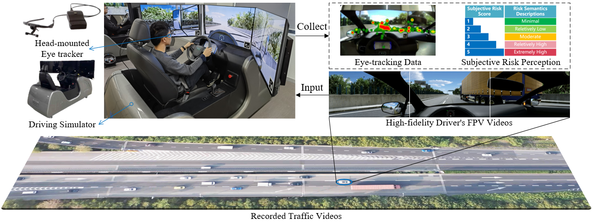
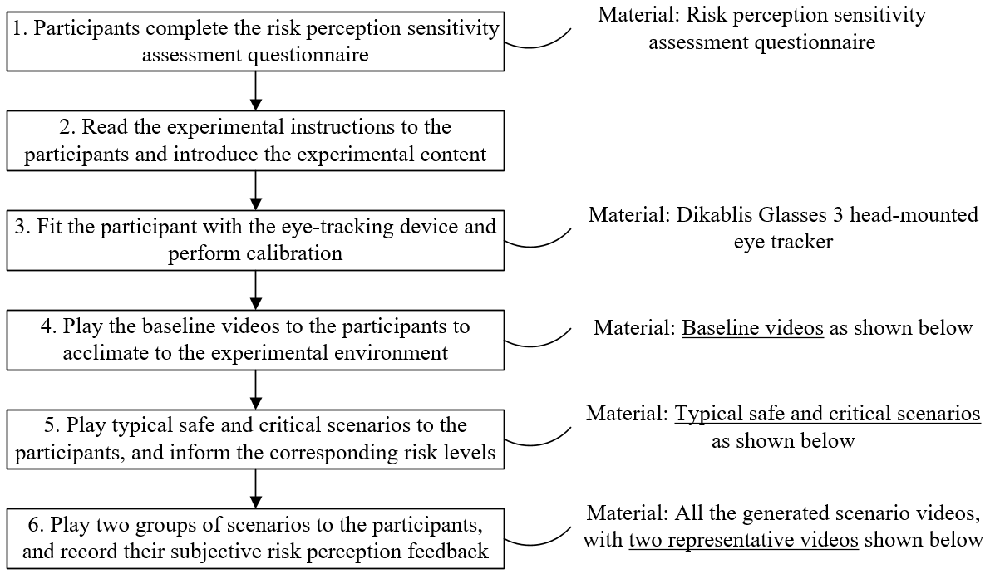

<br /><br /><br />

<div style="text-align: center;">
  
</div>

## Abstract

In the research and development (R&D) and verification and validation (V&V) phases of autonomous driving decision-making and planning systems, it is necessary to integrate human factors to achieve decision-making and evaluation that align with human cognition. However, most existing datasets primarily focus on vehicle motion states and trajectories, neglecting human-related information. In addition, current naturalistic driving datasets lack sufficient safety-critical scenarios while simulated datasets suffer from low authenticity. To address these issues, this paper constructs the Risk-Informed Subjective Evaluation and Eye-tracking (RISEE) dataset which specially contains human subjective evaluations and eye-tracking data apart from regular naturalistic driving trajectories. By leveraging the complementary advantages of drone-based (high realism and extensive scenario coverage) and simulation-based (high safety and reproducibility) data collection methods, we first conduct drone-based traffic video recording at a highway ramp merging area. After that, the manually selected highly interactive scenarios are reconstructed in simulation software, and drivers’ first-person view (FPV) videos are generated, which are then viewed and evaluated by recruited participants. During the video viewing process, participants’ eye-tracking data is collected. After data processing and filtering, 3567 valid subjective risk ratings from 101 participants across 179 scenarios are retained, along with 2045 qualified eye-tracking data segments.

## Data Collection Process

<div style="text-align: center;">
  
</div>

## Examples of FPV Videos

### Representive Scenarios
We present two representative highly interactive videos.
<div style="text-align: center;">
  <video src="src/videos_gifs/repre_sedan.mp4" controls="controls" width="853" height="160"></video>
</div>

<div style="text-align: center;">
  <video src="src/videos_gifs/repre_truck.mp4" controls="controls" width="853" height="160"></video>
</div>


### Typical Scenarios

Typical scenarios are used to calibrate participants’ risk expectations (i.e., all the viewed scenarios’ risk levels are bracketed between these two reference extremes).

- Typical Safe Scenario
<div style="text-align: center;">
  <video src="src/videos_gifs/typical_safe.mp4" controls="controls" width="853" height="160"></video>
</div>

- Typical Critical Scenario
<div style="text-align: center;">
  <video src="src/videos_gifs/typical_critical.mp4" controls="controls" width="853" height="160"></video>
</div>

### Baseline Scenarios

Baseline videos are used to acclimate participants to the viewing environment.

- Baseline Scenaro with a Sedan's Perspactive
<div style="text-align: center;">
  <video src="src/videos_gifs/baseline_sedan.mp4" controls="controls" width="853" height="160"></video>
</div>

- Baseline Scenaro with a Truck's Perspactive
<div style="text-align: center;">
  <video src="src/videos_gifs/baseline_truck.mp4" controls="controls" width="853" height="160"></video>
</div>

## Citation

```bibtex
@InProceedings{,
  
}
```

## Contact
If you have any questions or suggestions, please feel free to open an issue on [GitHub](https://github.com/IVtest-Lab/RISEE_dataset) or contact us (*wuxinzheng@tongji.edu.cn* or *chenjunyi@tongji.edu.cn*).